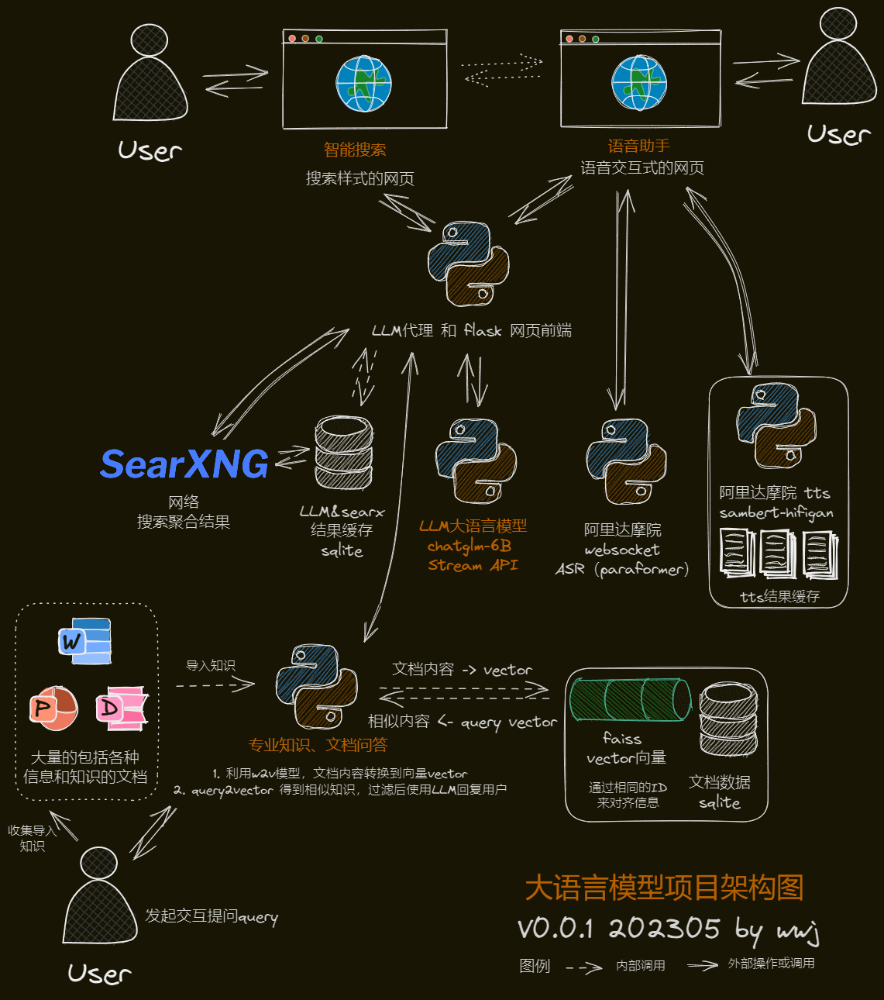

### 您好! 

- 🔭 我近期在关注大语言模型（LLM）、AIGC等。
- 🌱 我正在学习`任何感兴趣的东西`
- 👯 我的项目[StarrySky](https://github.com/wuwenjie1992/StarrySky)，欢迎star。😄😄😄该项目精选了千余repo，包括机器学习、深度学习、NLP、GNN、推荐系统、生物医药、机器视觉等内容。 
- 🤔 感悟：人生终似西山日，富贵原是草上霜。Life eventually resembles the setting sun, and wealth is but frost on the grass.
- 💬 可以问我关于：
- 📫 怎么联系我: wuwenjie0605#gmail
- ⚡ 有趣的事：1992年的中国上海，一对分别生于1966和1970年的夫妇赋予了我生命。
- 🌐 我的网站：[wuwenjie.xyz](http://www.wuwenjie.xyz/)
- 🌐 我的新闻网站：[既智新闻](http://www.wuwenjie.xyz/wordpress) ，特色是新闻标题、关键词、文章内容均为AI大语言模型生成，新闻信息来源是真实的。
- 😄 我最近的研究: 
 

  <h2> 🏆 我的Github统计 My Github Stats </h2> 
    <h2></h2> 
  
  
  4

   

  
<b>个人介绍 游览量</b>

  

